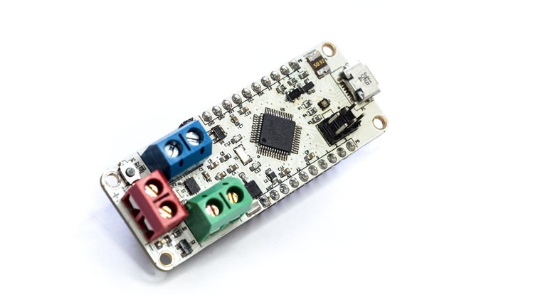

## What is it?

**ZeroDriver** is an Arduino Zero-compatible dual-motor driver board for robotics and mechatronics projects.

Robotics projects usually need two boards - a microcontroller board and a separate driver for the motors. ZeroDriver combines both in one for your convenience.

## Features & Specifications

* Atmel SAM D21 ARM Cortex-M0+ 48 MHz chip with 256KB Flash and 32KB SRAM
* Texas Instruments DRV8835 Dual Low-Voltage H-Bridge IC
* RGB LED
* Color coded terminal blocks for easy connectivity
* Standard 10-pin JTAG header broken out
* SPI header broken out
* Reverse polarity protection for power supply
* 12 V max power supply, 1.5 A current per H bridge
* Shipped with Arduino Zero bootloader for easy programming

## What can you do with it?

Well, depends on your imagination. :-)

But we do have some awesome demo projects - complete with code and design
information. Take a look at the [code](code/) directory.

## ZeroDriver Crowdfunding

We are currently trying to crowdfund the production of ZeroDriver at **Crowd Supply**.
Help us bring ZeroDriver to life!

https://www.crowdsupply.com/electronut-labs/zerodriver

## License

The following licenses apply to this work:

### Design Files

 ZeroDriver is licensed under a <a rel="license" href="http://creativecommons.org/licenses/by-sa/4.0/">Creative Commons Attribution-ShareAlike 4.0 International License</a>. Based on a work at <a xmlns:dct="http://purl.org/dc/terms/" href="http://electronut.in/" rel="dct:source">http://electronut.in/</a>.

### Pin Diagram
[Pinout](zerodriver-board-pinout.svg)
### Code

The MIT License (MIT)
Copyright (c) 2016 Electronut Labs (electronut.in)

Permission is hereby granted, free of charge, to any person obtaining a copy of this software and associated documentation files (the "Software"), to deal in the Software without restriction, including without limitation the rights to use, copy, modify, merge, publish, distribute, sublicense, and/or sell copies of the Software, and to permit persons to whom the Software is furnished to do so, subject to the following conditions:

The above copyright notice and this permission notice shall be included in all copies or substantial portions of the Software.

THE SOFTWARE IS PROVIDED "AS IS", WITHOUT WARRANTY OF ANY KIND, EXPRESS OR IMPLIED, INCLUDING BUT NOT LIMITED TO THE WARRANTIES OF MERCHANTABILITY, FITNESS FOR A PARTICULAR PURPOSE AND NONINFRINGEMENT. IN NO EVENT SHALL THE AUTHORS OR COPYRIGHT HOLDERS BE LIABLE FOR ANY CLAIM, DAMAGES OR OTHER LIABILITY, WHETHER IN AN ACTION OF CONTRACT, TORT OR OTHERWISE, ARISING FROM, OUT OF OR IN CONNECTION WITH THE SOFTWARE OR THE USE OR OTHER DEALINGS IN THE SOFTWARE.
