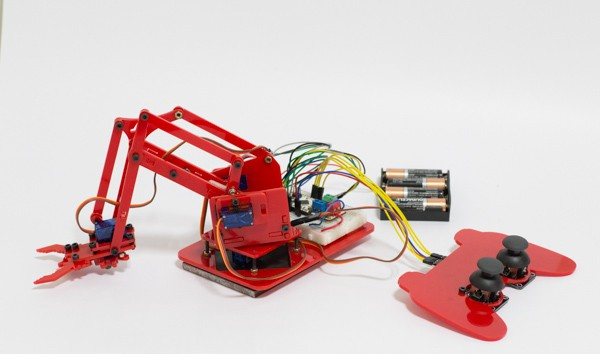

#####Joystick interface with ZeroDriver to control [MeArm](https://mime.co.uk/products/mearm/).

The design files for MeARM are available at the link mentioned above. 
Design file for the joystick pad has been inuded in the repository.

###Connections:
**Joystick** | **ZeroDriver**
-------- | ----------
VCC | 3V3
XPOS (left joystick) | A0
YPOS (left joystick) | A1
XPOS (right joystick) | A2
YPOS (right joystick) | A3

**Servo Motors** | **ZeroDriver**
------------ | ----------
Base | 4
Left | 5
Right | 6
Claw | 10

_Note:_
Power the servo motors from 4 x AA batteries.
