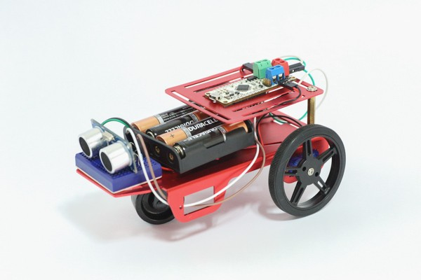

######ZeroDriver based object detecting 2 wheel bot. 

The Ultrasonic bot is an object detecting 2 wheel bot. The bot moves in a straight path unless obstructed with an object. If the bot detects an object within a range of 10 cms, it halts and reverses for a short distance. This is followed by a left turn to change the bot's trajectory. The RGB LED on ZeroDriver signifies various motions of the bot i.e 

###Connections:
**HCSR-04** | **ZeroDriver**
------- | ----------
VCC | 5V
trigger | 2
echo | 5

* Connect DC motors to green and blue terminal blocks.

_Note:_ 
HCSR-04 operates only when supplied with 5V. On powering with 3.3V, the sensor does not behave in a reliable manner. Naturally, on powering the sensor with 5V, the echo pin sends out 5V signals to the input pin 5 which can damage the board as the I/O pins are 3.3V compatible. Use a resistor divider network to generate 3.3V output from 5V echo signals.
