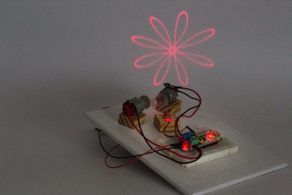

#####Patterns from a laser module and spinning motors.

Varying patterns can be generated by shining a laser beam mounted on two motors spinning at varying speed.
`random()` function is used to generate varying PWM values for the motors at an interval of 5 seconds.
Also, the motors are programmed to switch directions simultaneously. This is indicated by the switching of RGB LED between cyan and magenta colors.

###Connections:
**Motors** | **ZeroDriver**
------ | ----------
Red wire (motor1) | AOUT2(-) Green terminal
Black wire (motor1) | AOUT1(+) Green terminal
Red wire (motor2) | BOUT1(+) Blue terminal
Black wire (motor2) | BOUT2(-) Blue terminal

* The [Laser module](http://www.dx.com/p/6mm-5mw-red-laser-module-3-5-4-5v-13378#.WE-xKPl9602) has a 22 ohm resistor soldered to it and connected to 5V pin on the board.

_Note:_

Spin the motors in same and opposite direction to achieve varying patterns.
