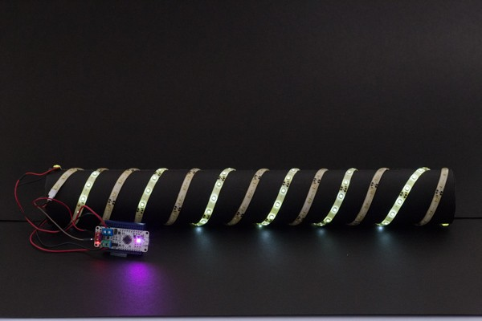

#####LED strip control using H-bridges.

Two LED strips are connected to two H-bridges of the DRV8835. The RGB LED switches between _cyan_ and _magenta_ in accordance to the LED strip.

###Connections:
**LED strip** | **ZeroDriver**
--------- | ----------
VCC (LED strip 1) | AOUT1(+) Green terminal
GND (LED strip 1) | AOUT2(-) Green terminal
VCC (LED strip 2) | BOUT1(+) Blue terminal
GND (LED strip 2) | BOUT2(-) Blue terminal

_Note:_
Power ZeroDriver as per the ratings of the LED strip. Do not cross the max 12V input limit. Here, the board is powered with a 7.4V, 1300mAh LiPo battery.
