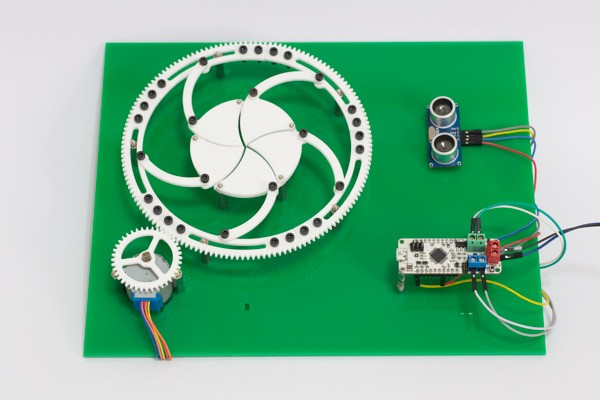

#####Mechanical iris control using ultrasonic sensor and stepper motor

Controlling a mechanical iris using a stepper motor and an ultrasonic sensor. On detecting an object, the gear mounted stepper motor rotates, causing the iris to open. On removing the object, the iris is closed.

The iris design is based on a project - [Make an Awesome Mechanical Iris](http://makezine.com/projects/mechanical-iris/) by [Chris Schaie](http://makezine.com/author/chris-schaie/) The iris design has been modified for this project and included in the repository.

###Connections:
**HCSR-04** | **ZeroDriver**
------- | ----------
VCC | 5V
trigger | 2
echo | 4

**Stepper motor** | **ZeroDriver**
------------- | ----------
Blue | BOUT2(-) Blue terminal
Pink | AOUT2(-) Green terminal
Yellow | BOUT1(+) Blue terminal
Orange | AOUT(+) Green terminal

_Note:_

* The BYJ-48 is being used as a bipolar stepper motor in this demonstration. Do not connect the red wire of stepper motor. 
* HCSR-04 operates only when supplied with 5V. On powering with 3.3V, the sensor does not behave in a reliable manner. Naturally, on powering the sensor with 5V, the echo pin sends out 5V signals to the input pin 5 which can damage the board as the I/O pins are 3.3V compatible. Use a resistor divider network to generate 3.3V output from 5V echo signals.

###Reference:
https://itp.nyu.edu/physcomp/labs/motors-and-transistors/lab-controlling-a-stepper-motor-with-an-h-bridge/

